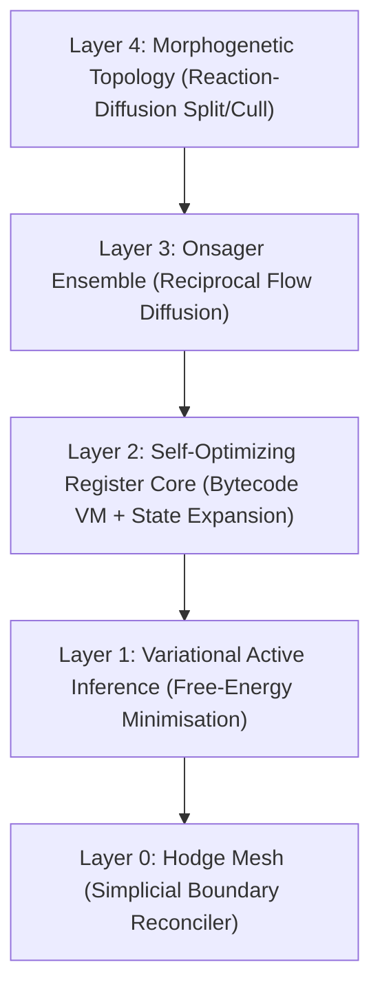

# Shivya: A Consensus-Free Distributed Resource-Sharing Mesh

[](https://github.com/jvoltci/shivya/actions)
[](https://crates.io/crates/shivya)
[](https://docs.rs/shivya)
[](https://github.com/jvoltci/shivya/blob/master/LICENSE-MIT)


Shivya is a bare-metal, zero-dependency Rust runtime for **load and state balancing across arrays of edge devices**. It is *not* a replacement for Paxos or Raft; it does not provide linearizable global ordering. What it does provide is:

1. **A curl-projection reconciler** (Hodge decomposition over a discrete simplicial state complex) that lets concurrent edge writes settle to a single curl-free state after partitions heal, without a consensus round.
2. **A multi-agent active-inference loop** that diffuses load through symmetric Onsager couplings, so nodes redistribute work toward minima of a collective variational free-energy functional.

The underlying mathematics is cited in [CITATIONS.md](CITATIONS.md). When this regime is appropriate is discussed in [docs/philosophy.md](docs/philosophy.md) (it is *not* a fit for workloads that require linearizable consistency).

---

## The 5-Layer Stack



### Layer 0: Topological Fabric [`shivya-hodge`](https://crates.io/crates/shivya-hodge)
- **What it is:** A simplicial state complex (vertices = nodes, edges = oriented flows, triangles = concurrent contexts) with the Discrete Exterior Calculus boundary operators d0 and d1.
- **What it does:** Decomposes any 1-chain (edge-flow) delta into gradient + curl + harmonic parts via the Hodge decomposition. The curl component — the rotational disagreement created by concurrent partition-writes — is projected out by solving the coexact Laplacian system `L₂ β = d₁ ΔS` with an in-tree Conjugate Gradient solver. The remaining flow is curl-free and identical across all nodes.

### Layer 1: Variational Active Inference [`shivya-flux`](https://crates.io/crates/shivya-flux)
- **What it is:** A Gaussian active-inference agent per node, with a generative model over internal beliefs `μ_q`, sensory observations `s`, and active states `a` bounded by a Markov blanket.
- **What it does:** Minimises Variational Free Energy `F = KL(q‖prior) + nll(s | g(μ_q))` via gradient descent on the belief mean. Matrix inversions are ridge-stabilised (1e-6 diagonal regularisation) — degenerate covariances never crash the daemon; see `SubstrateError` in [crates/shivya-flux/src/model.rs](crates/shivya-flux/src/model.rs).

### Layer 2: Self-Optimizing Register Core [`shivya-morphic`](https://crates.io/crates/shivya-morphic)
- **What it is:** A sandboxed register-machine bytecode VM with a hard 500-cycle budget per program, plus a generative model that can grow its own latent dimension at runtime.
- **What it does:** Compiles a small expression AST to register-machine instructions and evaluates them with no heap activity. When moving-average free energy crosses a novelty threshold, the agent's internal state space expands (e.g., from 2D to 3D) and the symbolic update law is re-mutated. The "metamorphic" component is a small stochastic hill-climb over expression trees — labelled honestly: it's genetic programming with a free-energy fitness, not anything more.

### Layer 3: Thermodynamic Collective Ensemble [`shivya-onsager`](https://crates.io/crates/shivya-onsager)
- **What it is:** A coupled set of active-inference agents with a symmetric Onsager flow matrix `L_ij = L_ji` and a Harsanyi-dividend computation over neighbourhood coalitions.
- **What it does:** Migrates belief parameters between adjacent agents at a rate proportional to belief-distance and `L_ij`. The collective free energy `F_collective = Σ F_i − Σ Harsanyi dividends` rewards synergistic neighbourhoods and penalises antagonistic ones, biasing the ensemble toward cooperative configurations. Coalition masks are encoded as `u8`, capping local coalitions at ≤ 8 nodes; the ensemble itself scales beyond that, only the per-node coalition computation does not.

### Layer 4: Morphogenetic Pattern Substrate [`shivya-turing`](https://crates.io/crates/shivya-turing)
- **What it is:** A graph-Laplacian Gierer-Meinhardt reaction-diffusion system over the node mesh, with RK4 integration and an explicit CFL stability bound (`dt ≤ 0.45 / (D_max · degree_max)`).
- **What it does:** Picks up local "stress" hot-spots from the activator field. High-activation nodes can fire a *split* (pre-allocated object-pool mitosis with no runtime resize); low-utility, low-activation nodes are culled (apoptosis), gated on a minimum-cluster-size floor so the mesh can't collapse.

---

## Decentralized P2P Transport [`shivya-p2p`](https://crates.io/crates/shivya-p2p)

The transport unifies geographically separated daemons into the same statistical field:
- **Kademlia XOR routing ([routing.rs](crates/shivya-p2p/src/routing.rs)):** 160-bit `NodeId`, K=4 stack-allocated buckets, LRU eviction protocol that pings the oldest peer before evicting it.
- **Kademlia RPC ([transport.rs](crates/shivya-p2p/src/transport.rs)):** `PING` / `PONG` / `FIND_NODE` / `FOUND_NODES` / `STORE` / `FIND_VALUE` / `FOUND_VALUE`, all single-MTU UDP frames with fixed-layout big-endian binary serialisation in [protocol.rs](crates/shivya-p2p/src/protocol.rs). A local DHT key/value store backs `STORE` / `FIND_VALUE`.
- **Partition-test hook:** Each transport exposes `block(addr)` / `unblock(addr)` to silently drop frames to a given address. Used by [tests/jepsen_partitions.rs](tests/jepsen_partitions.rs) and [tests/chaos_ensemble.rs](tests/chaos_ensemble.rs) to inject controllable partitions and assert that the Layer-0 reconciler cancels the curl introduced by the split.

---

## Native Edge Daemon (`shivya-cli`)

A Tokio multi-threaded daemon that samples real host telemetry via [`sysinfo`](https://docs.rs/sysinfo) (CPU load, NIC bytes RX/TX, memory pressure), steps the 5-layer stack on a 1 Hz interval, and bridges to the visualiser dashboard. It also ships a **`WorkloadMeshProxy`** facade ([crates/shivya-cli/src/bridge.rs](crates/shivya-cli/src/bridge.rs)) that maps idiomatic application signals onto the substrate:

```text
record_queue_len(node, q)        → 0-simplex mass at vertex
record_offload(src, dst, rate)   → oriented 1-chain entry on the edge
settle()                         → curl-free routing recommendation per edge
```

Use this if you don't want to read DEC papers — feed it queue lengths and offload rates, and `settle()` returns the substrate's recommendation for how to re-route work.

### CLI commands

- `--port <PORT>`: UDP listener port (default 8085).
- `--peer <ADDR:PORT>`: Bootstrap into an existing peer. Sends a `PING` followed by `FIND_NODE(self)` to seed iterative discovery.
- `--visualize`: Spawns a non-blocking WebSocket server on `127.0.0.1:9002` streaming orchestrator status to the dashboard.
- `--daemon` (unix only): `fork()` and session-detach via the `daemonize` crate *before* the Tokio runtime is constructed. PID file at `/tmp/shivya.pid`; stdout/stderr at `/tmp/shivya.{out,err}`.

```bash
# Seed node with live visualisation
cargo run --release -p shivya-cli -- start --port 8085 --visualize

# Bootstrap a second peer
cargo run --release -p shivya-cli -- start --port 8086 --peer 127.0.0.1:8085

# Query substrate status via local UDS
cargo run --release -p shivya-cli -- status
```

`SIGINT` / `SIGTERM` triggers an orderly shutdown that unbinds the socket file and notifies peers.

---

## Consistency Model

Shivya is **not** a CP system in the CAP sense. It does not give you linearizable reads, single-master semantics, or a transaction log.

What it *does* give you:

| Property | What's guaranteed | What's not |
|---|---|---|
| **Curl-free convergence** | After partitions heal, every node's edge-flow state projects to the same curl-free 1-chain. The Hodge projector is idempotent (the integration test asserts this to 1e-7). | Per-step ordering of writes between nodes. |
| **Continuous belief diffusion** | Adjacent agents exchange belief parameters at rate proportional to `L_ij`, biased by Harsanyi dividends. | Bounded staleness. Diffusion is asymptotic, not bounded-time. |
| **Free-energy minimisation** | Under stable observations, ensemble F trends down — verified under 15% packet loss + random node isolation + a hard partition in [tests/chaos_ensemble.rs](tests/chaos_ensemble.rs). | Monotonic descent step-by-step. F may temporarily rise under sharp observation changes. |
| **Survival under telemetry degeneracy** | Singular covariance matrices fall back to ridge-regularised (1e-6) inversion, then to the identity matrix. No `panic!` on the main path. | Numerical "quality" once telemetry collapses — you'll get a finite recommendation, but it carries less information. |
| **Network partition heal** | The Kademlia layer reconverges after split-brain. Chaos test confirms ≥ N/2 peers visible per node after recovery. | An explicit re-election. Recovery is bottom-up: peers find peers, then the math reconverges. |

Use Shivya when "eventually identical edge-flow state" is acceptable and you care about **avoiding the latency and complexity tax of consensus**. Don't use it when you need linearizable per-key semantics, an authoritative transaction log, or strict bounded staleness.

---

## Performance Envelope

Numbers below are from the workspace's own tests on a single laptop (Apple M-class, macOS). Take them as **order-of-magnitude indicators**, not benchmarks — there is no comparison to Raft/gossip yet.

| Operation | Cost / scale |
|---|---|
| `ensemble.step` (7 nodes, 2-D beliefs, full L0-L4 with chaos) | ~7-8 ms per step |
| `reconcile_state_delta` (6-edge bowtie complex, 2 triangles) | < 0.1 ms (CG solver converges in ≤ 10 iterations) |
| UDP transport `send_to` (per frame) | tens of µs (kernel-bound) |
| Full-mesh discovery, 7 real-UDP nodes on localhost | ~1.5 s to converge to N−1 peers, with retry |
| K-bucket capacity | K=4 per bucket × 160 buckets per node |
| Coalition mask (Harsanyi dividend computation) | u8 ⇒ ≤ 8 nodes per local coalition |
| Morphic VM instruction budget | hard cap, 500 cycles per program |

Convergence behaviour:
- **Curl projector**: idempotent. After one pass the residual `‖d₁ · S_reconciled‖` is below the CG tolerance (1e-8 by default).
- **Belief update (gradient descent on μ_q)**: monotonic on smooth observations; converges in ≤ 10 iterations to a 1e-4 gradient norm in the test cases.
- **Onsager ensemble F**: in the chaos test (7 nodes, 15% drop, hard partition, ~80 steps), F's trailing-10 average beats the leading-10 average; convergence is not strictly monotonic step-by-step.

---

## Rust Integration Example

```rust
use shivya::hodge::complex::SimplicialStateComplex;
use shivya::flux::model::GibbsFluxAgent;
use shivya::morphic::{DynamicGibbsAgent, MorphicHotSwapper, Expr};
use shivya::onsager::OnsagerCollectiveEnsemble;
use std::thread;
use std::time::Duration;

fn main() {
    println!("Initializing Shivya substrate...");

    // 1. Establish initial 3-node topology
    let adjacent_nodes = vec![
        vec![1, 2], // Node 0 neighbours
        vec![0, 2], // Node 1 neighbours
        vec![0, 1], // Node 2 neighbours
    ];

    // 2. Set up active-inference agents
    let create_agent = |mu_prior: f64| {
        DynamicGibbsAgent::new(
            2, 1, 2,
            vec![mu_prior, 0.0],
            vec![vec![10.0, 0.0], vec![0.0, 10.0]],
            vec![vec![1.5, 0.0], vec![0.0, 1.5]],
            vec![vec![0.1, 0.0], vec![0.0, 0.1]],
            vec![vec![0.0], vec![0.0]],
            vec![vec![0.0], vec![0.0]],
            vec![0.0, 0.0],
            vec![vec![1.0, 0.0], vec![0.0, 1.0]],
            5.0, // novelty threshold
        )
    };

    let agents = vec![create_agent(0.1), create_agent(0.2), create_agent(0.15)];

    // 3. Construct the Onsager ensemble
    let mut ensemble = OnsagerCollectiveEnsemble::new(agents, adjacent_nodes, 0.5);

    // 4. Run the loop in a worker thread
    let handle = thread::spawn(move || {
        let observations = vec![
            vec![1.2, 0.8],
            vec![2.0, 1.1],
            vec![1.5, 0.9],
        ];
        for step in 1..=5 {
            let collective_f = ensemble.step(&observations, 0.1, 10, 1e-4, 0.1);
            println!("Step {} -> Collective F: {:.6}", step, collective_f);
            thread::sleep(Duration::from_millis(50));
        }
    });

    handle.join().unwrap();
    println!("Loop terminated stably.");
}
```

For an application-level integration that *doesn't* require knowing what a 1-chain is, use `shivya-cli`'s `WorkloadMeshProxy` ([bridge.rs](crates/shivya-cli/src/bridge.rs)).

---

## Crates

All core crates are zero-dependency, stack-allocated where possible, and target `wasm32-unknown-unknown`:

- [`crates/shivya-hodge`](https://crates.io/crates/shivya-hodge) — Layer 0: simplicial DEC operators + curl projector
- [`crates/shivya-flux`](https://crates.io/crates/shivya-flux) — Layer 1: variational free-energy agent
- [`crates/shivya-morphic`](https://crates.io/crates/shivya-morphic) — Layer 2: self-optimising register VM
- [`crates/shivya-onsager`](https://crates.io/crates/shivya-onsager) — Layer 3: multi-agent thermodynamic ensemble
- [`crates/shivya-turing`](https://crates.io/crates/shivya-turing) — Layer 4: reaction-diffusion topology adaptation
- [`crates/shivya-p2p`](https://crates.io/crates/shivya-p2p) — Kademlia XOR routing + UDP transport
- [`crates/shivya-telemetry`](https://crates.io/crates/shivya-telemetry) — WASM bindings + browser orchestrator
- [`crates/shivya-cli`](https://crates.io/crates/shivya-cli) — native daemon + UDS CLI + `WorkloadMeshProxy`

---

## License

Distributed under the terms of both the MIT license and the Apache License (Version 2.0).
See [LICENSE-MIT](LICENSE-MIT) and [LICENSE-APACHE](LICENSE-APACHE) for details.
