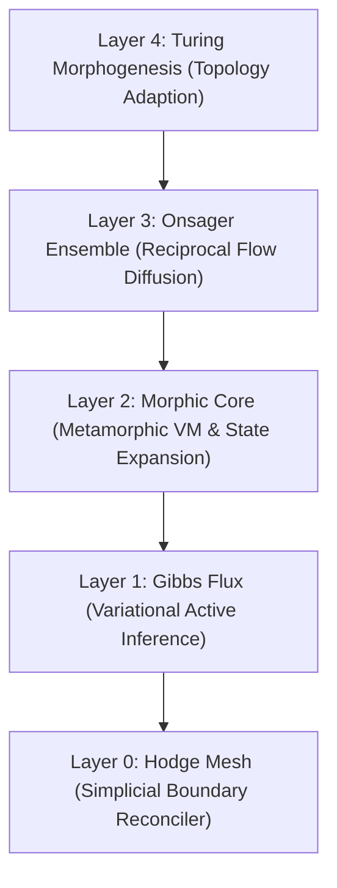

# Shivya: The Non-Dual Distributed Computing Substrate

[](https://github.com/jvoltci/shivya/actions)
[](https://crates.io/crates/shivya)
[](https://docs.rs/shivya)
[](https://github.com/jvoltci/shivya/blob/master/LICENSE-MIT)



Shivya is a bare-metal, zero-dependency, edge-native distributed substrate. It discards dualistic, clock-synchronized consensus models (e.g. Paxos, Raft, Nakamoto Consensus) in favor of a continuous, thermodynamic geometric manifold driven by Discrete Exterior Calculus and Variational Free Energy minimization.

---

## The 5-Layer Architectural Stack



### Layer 0: Topological Fabric [`shivya-hodge`](https://crates.io/crates/shivya-hodge)
- **Core Abstraction:** Simplicial State Complexes and Discrete Exterior Calculus (DEC).
- **Function:** Solves structural boundary flow equations using an iterative Conjugate Gradient solver. It partitions concurrent network partitions into a gradient flow (non-conflicting mutations) and a curl flow (rotational conflict loops), projecting out the curl to arrive at consistent states deterministically without time locks.

### Layer 1: Predictive Homeostasis [`shivya-flux`](https://crates.io/crates/shivya-flux)
- **Core Abstraction:** Variational Free Energy Principle (FEP).
- **Function:** Represents nodes as Active Inference Agents bound by statistical Markov Blankets. Nodes minimize Variational Free Energy ($F$) via continuous gradient descent over internal belief parameters to adapt to non-stationary sensorimotor telemetry.

### Layer 2: Autotelic Morphic Core [`shivya-morphic`](https://crates.io/crates/shivya-morphic)
- **Core Abstraction:** Metamorphic VM Hot-Swapping & State Space Expansion.
- **Function:** Evaluates structural update loops inside a sandboxed, stack-allocated Register VM with strict instruction cycle budgets. When moving average free energy breaches novelty thresholds, the node expands its generative state dimensions (e.g., from 2D to 3D) and rewrites its execution bytecode.

### Layer 3: Thermodynamic Collective Ensemble [`shivya-onsager`](https://crates.io/crates/shivya-onsager)
- **Core Abstraction:** Onsager Reciprocal Relations & Game-Theoretic FEP.
- **Function:** Regulates parameter and workload migration across blankets via symmetric conductance couplings ($L_{ij} = L_{ji}$). Computes global Collective Free Energy ($\mathcal{F}_{\text{collective}}$) by resolving Harsanyi dividends recursively over adjacent neighbor coalitions to enforce cooperative synergy.

### Layer 4: Morphogenetic Pattern Substrate [`shivya-turing`](https://crates.io/crates/shivya-turing)
- **Core Abstraction:** Non-linear Graph Reaction-Diffusion & Network Plasticity.
- **Function:** Solves activator-inhibitor partial differential equations using Runge-Kutta 4th Order (RK4) integration with dynamic CFL stability guards. High-stress activator hotspots trigger zero-allocation vertex mitosis (node splits), while low-utility nodes undergo apoptosis (culling) to optimize global resource usage.

---

## Decentralized P2P Mesh Architecture

To unify geographically separated hardware edge daemons into a cooperative statistical field, Shivya utilizes a decentralized peer-to-peer transport layer (`crates/shivya-p2p`):
- **XOR Kademlia Routing (`src/routing.rs`):** Nodes generate a unique 160-bit identifier (`NodeId`) and maintain stack-allocated K-buckets ($K=4$). Stale nodes are kept at bay using an active **LRU Ping Eviction Guard**.
- **Thermodynamic UDP Framing (`src/transport.rs`):** Low-overhead, zero-heap packet serialization that transmits state-difference vectors, parameter diffs, and simplicial splits across nodes in Big-Endian float format.

---

## Native Edge Daemon CLI (`shivya-cli`)

Shivya includes a high-performance native command-line daemon (`crates/shivya-cli`) configured with a multi-threaded Tokio runtime. It runs headless in the background, sampling physical hardware telemetry (CPU load and network throughput) to step the 5-layer active inference substrate in real-time, while bridging topology splits and state updates to a premium visualizer dashboard.

### CLI Daemon Commands & Options

The CLI `start` subcommand supports several options to configure the peer-to-peer network and live visualization bridge:

- `--port <PORT>`: The UDP port to bind the P2P thermodynamic transport listener (defaults to `8085`).
- `--peer <ADDR:PORT>`: Optional address of an existing peer to bootstrap into the causal simplicial network.
- `--visualize`: Spawns a non-blocking WebSocket server on `127.0.0.1:9002` to stream physical telemetry, state-differences, and network graphs live to the WebOS observability dashboard.

### Running the CLI Daemon

1. **Start a Seed Node with Live Visualization**:
   ```bash
   cargo run --release -p shivya-cli -- start --port 8085 --visualize
   ```
   *Note: On startup, the daemon automatically cleans up any stale Unix Domain Sockets (UDS) and binds safely to `/tmp/shivya_cli.sock`.*

2. **Boot up a Bootstrap Peer Node**:
   Connects to the seed node, building a mutual causal simplicial network:
   ```bash
   cargo run --release -p shivya-cli -- start --port 8086 --peer 127.0.0.1:8085
   ```

3. **Query Substrate Registry Status**:
   Connects to the local background UDS server to fetch and print the real-time active inference, VM mutation, and topological metrics:
   ```bash
   cargo run --release -p shivya-cli -- status
   ```

4. **Graceful Teardown**:
   Send a `SIGINT` (Ctrl+C) or `SIGTERM` signal to trigger orderly apoptotic memory cleanup, unbind the socket file, and notify connected peers.

---

## Rust Integration Example

```rust
use shivya::hodge::complex::SimplicialStateComplex;
use shivya::flux::model::GibbsFluxAgent;
use shivya::morphic::{DynamicGibbsAgent, MorphicHotSwapper, Expr};
use shivya::onsager::OnsagerCollectiveEnsemble;
use std::thread;
use std::time::Duration;

fn main() {
    println!("Initializing Shivya Substrate...");

    // 1. Establish initial 3-node topology
    let mut adjacent_nodes = vec![
        vec![1, 2], // Node 0 neighbors
        vec![0, 2], // Node 1 neighbors
        vec![0, 1], // Node 2 neighbors
    ];

    // 2. Set up Gibbs Active Inference Agents
    let create_agent = |mu_prior: f64| {
        DynamicGibbsAgent::new(
            2, 1, 2,
            vec![mu_prior, 0.0],
            vec![vec![10.0, 0.0], vec![0.0, 10.0]],
            vec![vec![1.5, 0.0], vec![0.0, 1.5]],
            vec![vec![0.1, 0.0], vec![0.0, 0.1]],
            vec![vec![0.0], vec![0.0]],
            vec![vec![0.0], vec![0.0]],
            vec![0.0, 0.0],
            vec![vec![1.0, 0.0], vec![0.0, 1.0]],
            5.0, // Novelty threshold
        )
    };

    let agents = vec![
        create_agent(0.1),
        create_agent(0.2),
        create_agent(0.15),
    ];

    // 3. Construct the Onsager Collective Ensemble
    let mut ensemble = OnsagerCollectiveEnsemble::new(agents, adjacent_nodes, 0.5);

    // 4. Run the homeostatic execution loop inside a runtime thread
    let handle = thread::spawn(move || {
        let observations = vec![
            vec![1.2, 0.8], // Node 0 sensory inputs
            vec![2.0, 1.1], // Node 1 sensory inputs
            vec![1.5, 0.9], // Node 2 sensory inputs
        ];

        for step in 1..=5 {
            let collective_f = ensemble.step(
                &observations,
                0.1,   // Learning rate
                10,    // Max belief iterations
                1e-4,  // Convergence tolerance
                0.1    // Onsager migration rate
            );
            println!("Step {} -> Collective Free Energy: {:.6}", step, collective_f);
            thread::sleep(Duration::from_millis(50));
        }
    });

    handle.join().unwrap();
    println!("Homeostatic loop terminated stably.");
}
```

---

## Crate Layout & Distribution namespaces

All core modules are zero-dependency, stack-allocated, and target WebAssembly (`wasm32-unknown-unknown`):
- [`crates/shivya-hodge`](https://crates.io/crates/shivya-hodge) - Layer 0 Simplicial exterior calculus
- [`crates/shivya-flux`](https://crates.io/crates/shivya-flux) - Layer 1 Homeostatic Active Inference agent
- [`crates/shivya-morphic`](https://crates.io/crates/shivya-morphic) - Layer 2 Sandboxed metamorphic register VM
- [`crates/shivya-onsager`](https://crates.io/crates/shivya-onsager) - Layer 3 Thermodynamic multi-agent ensemble
- [`crates/shivya-turing`](https://crates.io/crates/shivya-turing) - Layer 4 Network reaction-diffusion morphogenesis
- [`crates/shivya-p2p`](https://crates.io/crates/shivya-p2p) - Decentralized Kademlia P2P transport & UDP network mesh
- [`crates/telemetry_wasm`](https://crates.io/crates/telemetry_wasm) - Unified Substrate WASM telemetry bindings
- [`crates/shivya-cli`](https://crates.io/crates/shivya-cli) - High-performance native background daemon & Tokyo-UDS CLI tool

---

## License

This framework is distributed under the terms of both the MIT license and the Apache License (Version 2.0).
See [LICENSE-MIT](LICENSE-MIT) and [LICENSE-APACHE](LICENSE-APACHE) for details.
