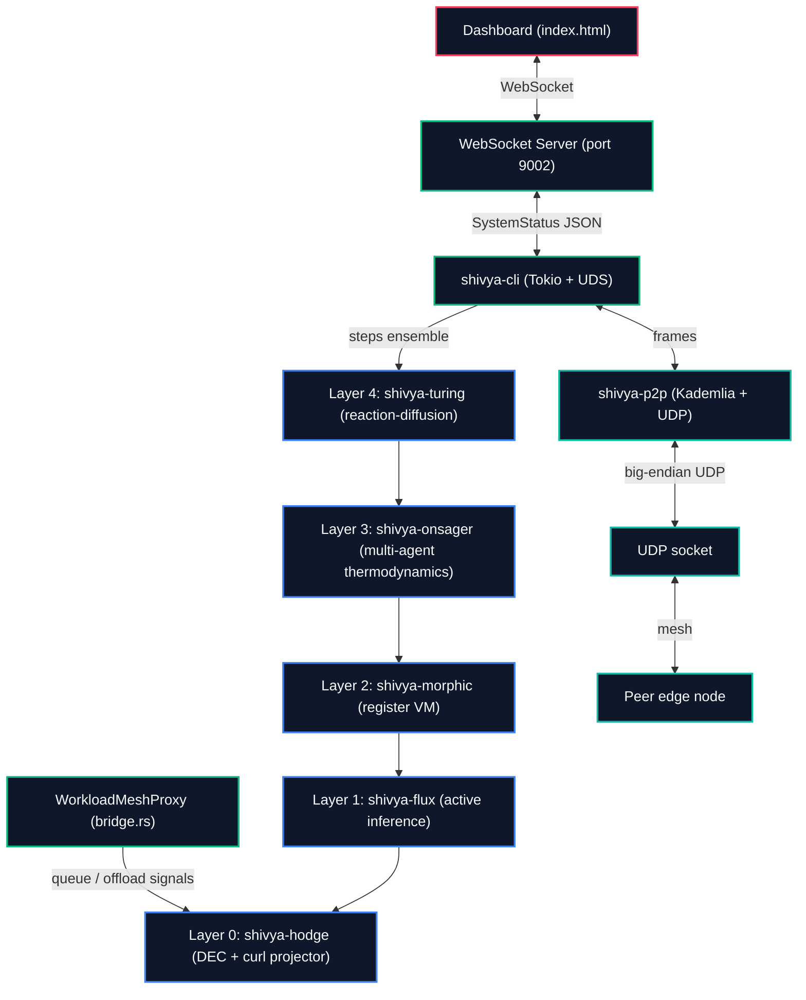

# Shivya: Technical Architecture

This document describes the software components, mathematical operators, and architectural relationships that make up the Shivya consensus-free distributed resource-sharing mesh.

---

## 1. Workspace Topology

Shivya is a Rust virtual workspace. The core mathematical crates have zero external dependencies; runtime concerns (Tokio, sysinfo, WebSocket, daemonisation) are isolated in the boundary crates.

---

## 2. Core Crate Layout

### Layer 0: Topological Fabric (`crates/shivya-hodge`)

- **SimplicialStateComplex ([src/complex.rs](../crates/shivya-hodge/src/complex.rs)):** A discrete simplicial complex with strings as vertex labels.
  - **0-simplices (vertices):** local state mass at a node.
  - **1-simplices (edges):** oriented state flow between two nodes.
  - **2-simplices (triangles):** detected automatically whenever three vertices are pairwise connected — represents a concurrent-context boundary that can carry rotational (curl) tension.
- **DEC operators ([src/operators.rs](../crates/shivya-hodge/src/operators.rs)):**
  - **d₀ (boundary, gradient):** maps vertex potentials → edge flows.
  - **d₁ (boundary, curl):** maps edge flows → triangle circulations, signs `(+v→w, −u→w, +u→v)` per face.
  - **δ₁ (codifferential, divergence):** `d₀ᵀ`.
- **Conjugate Gradient Solver ([src/solver.rs](../crates/shivya-hodge/src/solver.rs)):** Standard CG recurrence for symmetric positive (semi)definite systems. Tolerance 1e-8, max 1000 iterations.
- **Reconciler ([src/reconciler.rs](../crates/shivya-hodge/src/reconciler.rs)):** Computes the Hodge decomposition:
  $$\Delta S = d_0 \alpha + d_1^T \beta + \gamma$$
  Isolates the curl `d₁ᵀβ` by solving `L₂ β = d₁ ΔS` (with `L₂ = d₁ d₁ᵀ`) and projects it out:
  $$\Delta S_{\text{reconciled}} = \Delta S - d_1^T \beta$$
  The result is curl-free and identical on all nodes that observe the same complex.

### Layer 1: Active Inference (`crates/shivya-flux`)

- **GibbsFluxAgent ([src/model.rs](../crates/shivya-flux/src/model.rs)):** Gaussian active-inference agent. Generative model parameters `(μ_prior, Σ_prior, G_s, Σ_s_0, W, m)`, preferences `(μ_pref, Σ_pref)`, internal posterior `(μ_q, Σ_q)`.
- **Variational Free Energy** over observations `s` and belief mean `μ_q`:
  $$F = D_{\text{KL}}(q(\vartheta|\mu_q)\,\|\,p(\vartheta)) + \tfrac{1}{2}\Big( S \ln 2\pi + \ln |\Sigma_s| + (s - G_s\mu_q)^\top \Sigma_s^{-1}(s - G_s\mu_q) + \text{tr}(G_s^\top \Sigma_s^{-1} G_s \Sigma_q)\Big)$$
- **Expected Free Energy** (policy evaluation): pragmatic = `KL( pred_obs ‖ pref )`, epistemic = `0.5 ln((2πe)^k |Σ_q|)`.
- **Error model:** matrix inversions go through a stabilised path. On singular input the implementation adds a `RIDGE_EPSILON = 1e-6` diagonal and retries; on second failure it returns the identity matrix (= "no information" prior). Every failure is recordable through `SubstrateError`. No `panic!` on the main path.

### Layer 2: Self-Optimizing Register Core (`crates/shivya-morphic`)

- **vm/compiler + eval ([crates/shivya-morphic/src/vm/](../crates/shivya-morphic/src/vm/)):** A 4-opcode register machine (`Const`, `Var`, `Add`, `Mul`) with a hard 500-instruction budget per evaluation. The compiler walks the expression AST and emits straight-line code; the evaluator executes against a per-step Vec of registers — no heap recursion.
- **DynamicGibbsAgent ([autotelic.rs](../crates/shivya-morphic/src/autotelic.rs)):** A dynamically-sized variant of the static `GibbsFluxAgent`. Same VFE, EFE, gradient-descent loop, but with `Vec<Vec<f64>>` shapes so the internal dimension can grow at runtime via `expand_state_space()` when the moving-average free energy crosses the novelty threshold `tau_novelty`.
- **MorphicHotSwapper ([metamorphic.rs](../crates/shivya-morphic/src/metamorphic.rs)):** Genetic-programming hill-climb: mutate the current symbolic update law, evaluate on a small dataset, accept if MSE drops. Honest naming: this is GP with a free-energy proxy, not anything more exotic.
- **Stability helpers ([dyn_mat_inv_stable](../crates/shivya-morphic/src/autotelic.rs)):** Counterpart of the `MatrixMath::inv()` helper in `shivya-flux`. Plain inverse → ridge fallback → identity. Per-thread last-failure record exposed via `last_stabilization_event()`.

### Layer 3: Onsager Ensemble (`crates/shivya-onsager`)

- **OnsagerCollectiveEnsemble ([src/ensemble.rs](../crates/shivya-onsager/src/ensemble.rs)):** Holds `N` `DynamicGibbsAgent`s and an adjacency list.
  - Per step: every agent runs its own belief update; the Onsager flow regulator migrates `μ_q` parameters between adjacent agents at rate proportional to belief-distance × `L_ij`; collective F is computed as `Σ F_i − Σ Harsanyi dividends`.
- **OnsagerFlowRegulator ([field.rs](../crates/shivya-onsager/src/field.rs)):** Symmetric flow matrix `L_ij = L_ji` (reciprocity enforced by construction). Parameter flows are antisymmetric (`flows[j][i] = −flows[i][j]`).
- **LocalCoalitionSolver ([harsanyi.rs](../crates/shivya-onsager/src/harsanyi.rs)):** Möbius-recursion Harsanyi dividends over a node's neighbourhood coalitions. Mask type is `u8`, so coalitions cap at 8 nodes per local computation; the ensemble itself scales beyond that, only the per-node coalition step does not.

### Layer 4: Morphogenetic Topology (`crates/shivya-turing`)

- **MorphogenSystem ([morphogen.rs](../crates/shivya-turing/src/morphogen.rs)):** Graph-Laplacian Gierer-Meinhardt reaction-diffusion. `step_rk4(dt)` is a proper 4-stage Runge-Kutta. `get_cfl_dt()` returns a CFL-bounded dt: `dt ≤ 0.45 / (D_max · degree_max)`, ensuring numerical stability on the discrete Laplacian.
- **MitosisEngine ([mitosis.rs](../crates/shivya-turing/src/mitosis.rs)):** When activator `u[i]` exceeds `theta_mitosis`, allocates a pre-reserved slot from an object pool (no runtime heap resize) and seeds a child with `u[i] ± epsilon` to break symmetry.
- **ApoptosisEngine ([apoptosis.rs](../crates/shivya-turing/src/apoptosis.rs)):** Culls nodes whose activator and utility (free-energy-derived) are both below threshold, gated on a ≥ 3-node integrity floor so the mesh cannot collapse.

---

## 3. P2P Transport (`crates/shivya-p2p`)

- **Kademlia XOR routing ([routing.rs](../crates/shivya-p2p/src/routing.rs)):**
  - 160-bit `NodeId`s (typically derived from a per-host PRNG; `tests/chaos_ensemble.rs` shows how to construct deterministic IDs for reproducible test runs).
  - Stack-allocated K-buckets, `K = 4`, `BUCKET_COUNT = 160`.
  - LRU-on-insert: most recently active peer ends up at the tail of its bucket.
  - When a bucket is full, the candidate triggers a `BucketFullPendingEviction`: the receive loop pings the oldest peer; if no response in 500 ms the candidate replaces it.
- **Protocol ([protocol.rs](../crates/shivya-p2p/src/protocol.rs)):** Fixed-layout, single-MTU UDP frames. 4-byte magic prefix, 25-byte header, typed payloads. Round-trip tests for every payload type. `MAX_VALUE_BYTES = 256`. IPv4-only sockaddr serialisation today.
- **RPCs ([transport.rs](../crates/shivya-p2p/src/transport.rs)):** `PING` / `PONG` / `FIND_NODE` / `FOUND_NODES` / `STORE` / `FIND_VALUE` / `FOUND_VALUE`, with iterative discovery: a `FoundNodes` reply triggers PINGs to every newly-learned peer, and a `FoundValue` with `value: None` triggers further `FindValue` requests against the returned peers.

---

## 4. Native Daemon (`crates/shivya-cli`)

- **TelemetrySampler ([src/telemetry.rs](../crates/shivya-cli/src/telemetry.rs)):** Wraps `sysinfo`. Samples CPU load, NIC bytes RX/TX delta, memory pressure on a 1 Hz interval.
- **NativeOrchestrator ([src/orchestrator.rs](../crates/shivya-cli/src/orchestrator.rs)):** Wires telemetry samples to the 5-layer stack, projects K-bucket peers into the Layer-0 simplicial complex, scales the Onsager base coupling by network/memory pressure, and broadcasts `ThermodynamicPush` frames to all discovered peers per step.
- **WorkloadMeshProxy ([src/bridge.rs](../crates/shivya-cli/src/bridge.rs)):** Application facade. `record_queue_len`/`record_offload` map domain signals to 0-/1-simplex flows. `settle()` runs the curl projector and returns `EdgeRecommendation`s — curl-free recommended offload rates per edge.
- **WebSocket bridge ([main.rs](../crates/shivya-cli/src/main.rs)):** Listens on `127.0.0.1:9002` under `--visualize`. Uses `tokio::sync::broadcast` so a lagging dashboard client cannot back-pressure the orchestrator's update loop.
- **Daemonisation:** `fork()` and session-detach via the `daemonize` crate occur **before** the Tokio runtime is constructed — reactor file descriptors live in the detached child.

---

## 5. Stability and Error Surfaces

Recurring numerical failures bubble up through `shivya_flux::SubstrateError`:

| Variant | When it fires | What the runtime does |
|---|---|---|
| `SingularMatrix { size, det }` | Plain matrix inverse failed | Adds `RIDGE_EPSILON = 1e-6` to the diagonal and retries. |
| `StabilizationFailed { size, ridge }` | Even ridge-regularised inverse failed | Returns the identity matrix (= maximum-entropy prior). |
| `DimensionMismatch { expected, actual }` | Vector / matrix shape mismatch | Caller-handled; never reached on the main path. |

The chaos test (`tests/chaos_ensemble.rs`) drives the full L0-L4 stack under 15% UDP packet loss, random per-node isolation windows, and a programmatic split-brain partition. It asserts that:

1. Every spawned task is still alive at the end (final PINGs round-trip).
2. Every node's K-bucket table has recovered ≥ N/2 peers.
3. Collective F's trailing-10-step average is strictly below its leading-10-step average — i.e., the substrate is still minimising under chaos.
