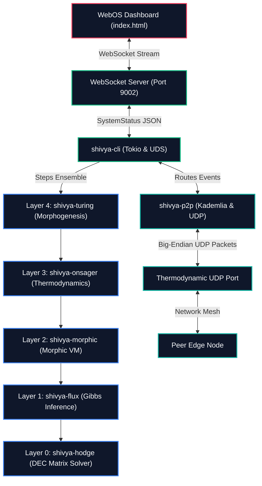

# SHIVYA: The Non-Dual Substrate — Technical Architecture

This document describes the concrete software components, mathematical operators, and architectural relationships that comprise the **SHIVYA** distributed edge execution engine.

---

## 1. Unified Workspace Topology

SHIVYA is implemented as a multi-crate Rust virtual workspace. It isolates the core mathematical layers from platform-specific runtime behaviors to achieve zero external dependencies in the consensus and thermodynamic layers, while enabling high-throughput native networking and web visualization at the boundaries.

---

## 2. Core Crate Layout & Specifications

### Layer 0: Topological Fabric (`crates/shivya-hodge`)
- **SimplicialStateComplex (`src/complex.rs`):** Tracks causal event histories as a directed simplicial complex.
  - **0-simplices (Vertices $V$):** Causal events.
  - **1-simplices (Edges $E$):** Causal flows / transitions between events.
  - **2-simplices (Triangles $T$):** Formed automatically on concurrent context boundaries to represent concurrent branches.
- **DEC Operators (`src/operators.rs`):** Implements Discrete Exterior Calculus (DEC) operators:
  - **Exterior Derivative $d_0$ (Gradient):** Maps vertex potentials to edge flows.
  - **Exterior Derivative $d_1$ (Curl):** Maps edge flows to triangle circulations.
  - **Codifferential $\delta_1$ (Divergence):** Implemented as the transpose/adjoint $d_0^T$.
- **Conjugate Gradient Solver (`src/solver.rs`):** Stack-allocated, zero-heap Conjugate Gradient solver optimized for sparse symmetric positive semi-definite (SPSD) systems.
- **Geodesic Reconciler (`src/reconciler.rs`):** Resolves topological conflicts via the **Hodge Decomposition**:
  $$\Delta S = d_0 \alpha + d_1^T \beta + \gamma$$
  It isolates the rotational curl loop $d_1^T \beta$ by solving $L_2 \beta = d_1 \Delta S$ (where $L_2 = d_1 d_1^T$) and projects it out to arrive at identical, reconciled states.

### Layer 1: Predictive Homeostasis (`crates/shivya-flux`)
- **GibbsFluxAgent (`src/model.rs`):** Implements the Variational Free Energy Principle (FEP). Nodes act as active inference agents that maintain internal beliefs about external sensory metrics.
- Computes **Variational Free Energy** ($F$) over sensory input vectors ($s$) and internal beliefs ($\mu$):
  $$F = \text{D}_{\text{KL}}[q(\vartheta|\mu) \parallel p(\vartheta)] - \int q(\vartheta|\mu) \ln p(s,\vartheta) d\vartheta$$
- Minimizes $F$ via gradient descent to maintain system balance.

### Layer 2: Autotelic Morphic Core (`crates/shivya-morphic`)
- **MorphicVM (`src/vm.rs`):** A lightweight, sandboxed metamorphic register VM with strict cycle budgets.
- Steps dynamic state programs. When moving average free energy breaches novelty thresholds, it hot-swaps bytecode and expands its generative state space dimensions.

### Layer 3: Thermodynamic Ensemble (`crates/shivya-onsager`)
- **OnsagerCollectiveEnsemble (`src/ensemble.rs`):** Models multi-agent cooperative coalitions. Regulates parameter and workload migration across blankets via symmetric conductance couplings ($L_{ij} = L_{ji}$).

### Layer 4: Morphogenetic Pattern Substrate (`crates/shivya-turing`)
- **TuringSubstrate (`src/turing.rs`):** Simulates activator-inhibitor partial differential equations using Runge-Kutta 4th Order (RK4) integration with dynamic stability checks.
- Activator peaks trigger vertex mitosis (node division), while low-utility nodes undergo apoptosis (pruning) to optimize global resource allocation.

---

## 3. Distributed P2P Transport (`crates/shivya-p2p`)

The P2P transport namespace unifies separate physical daemons into a single causal simplicial complex over loopback/Ethernet UDP:
- **Kademlia XOR Routing (`src/routing.rs`):**
  - Unique 160-bit `NodeId` identifiers calculated from public keys or network coordinates.
  - Stack-allocated K-buckets ($K=4$) tracking neighboring peers grouped by XOR distance:
    $$d(x, y) = x \oplus y$$
  - **LRU Ping Eviction Guard**: Full buckets trigger asynchronous ping verification to ensure stale nodes are immediately replaced.
- **Thermodynamic Wire Protocol (`src/transport.rs`):**
  - High-performance, zero-heap binary serialization.
  - Big-Endian float encoding ensuring perfect consistency across diverse CPU architectures.

---

## 4. Native Edge Daemon & WebOS Bridge (`crates/shivya-cli`)

The native binary crate binds the entire workspace together inside a high-throughput async runtime:
- **System Telemetry Sampler (`src/telemetry.rs`):** Collects CPU load and network interface packet rates using `sysinfo` to step the active inference agent in real-time.
- **WebSocket Broadcast Bridge (`src/main.rs`):**
  - Listens on `127.0.0.1:9002` if `--visualize` is enabled.
  - Subscribes to the internal `tokio::sync::broadcast` stream and forwards system status JSON frames to the frontend visualizer.
  - Employs a non-blocking `RecvError::Lagged` recovery pattern to survive background browser tab throttling without slowing down the active computing loop.
