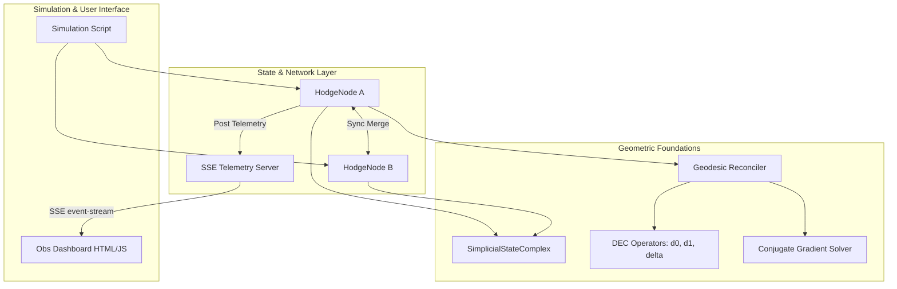

# HodgeMesh Technical Architecture

This document describes the concrete software components and mathematical operators that comprise the **HodgeMesh** (Layer 0) execution engine.

---

## Component Layout

---

## 1. SimplicialStateComplex (`complex.py`)
Tracks causal event histories as a directed simplicial complex:
- **0-simplices (Vertices $V$):** Events. Each vertex tracks its causal parents.
- **1-simplices (Edges $E$):** Directed transitions. If vertex $u$ is a parent of $v$, the edge is $(u, v)$.
- **2-simplices (Triangles $T$):** Formed automatically when a vertex has multiple parents that are themselves causally connected. This preserves the simplicial topology and represents concurrent branches.

---

## 2. DEC Operators (`operators.py`)
Computes the linear operators on $k$-cochains:
- **Exterior Derivative $d_0$ (Gradient):** Maps 0-cochains (vertex potentials) to 1-cochains (edge flows).
- **Exterior Derivative $d_1$ (Curl):** Maps 1-cochains (edge flows) to 2-cochains (triangle circulations).
- **Codifferential $\delta_1$ (Divergence):** Maps 1-cochains to 0-cochains. Implemented as the adjoint $d_0^T$.
- **Laplacian Operators:**
  - $L_0 = d_0^T d_0$ (Vertex Laplacian)
  - $L_2 = d_1 d_1^T$ (Triangle Laplacian)

---

## 3. Iterative CG Solver (`solver.py`)
A pure-standard-library Conjugate Gradient solver optimized for sparse symmetric positive semi-definite (SPSD) systems.
- Solves $A x = b$ for Laplacians where $A$ has a non-trivial null space.
- Runs to a convergence tolerance of $10^{-6}$ squared residual norm.

---

## 4. Conflict Reconciler (`reconciler.py`)
Performs the Hodge Decomposition.
1. Computes the curl discrepancy vector $b_2 = d_1 \Delta S$.
2. Solves the coexact system $L_2 \beta = b_2$.
3. Computes the coexact conflict flow: $S_{coexact} = d_1^T \beta$.
4. Reconciles the flow: $\Delta S_{reconciled} = \Delta S - S_{coexact}$.
5. Integrates $\Delta S_{reconciled}$ into vertex state potentials using a topological line integral starting from `genesis`.
